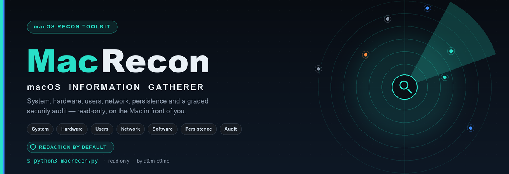
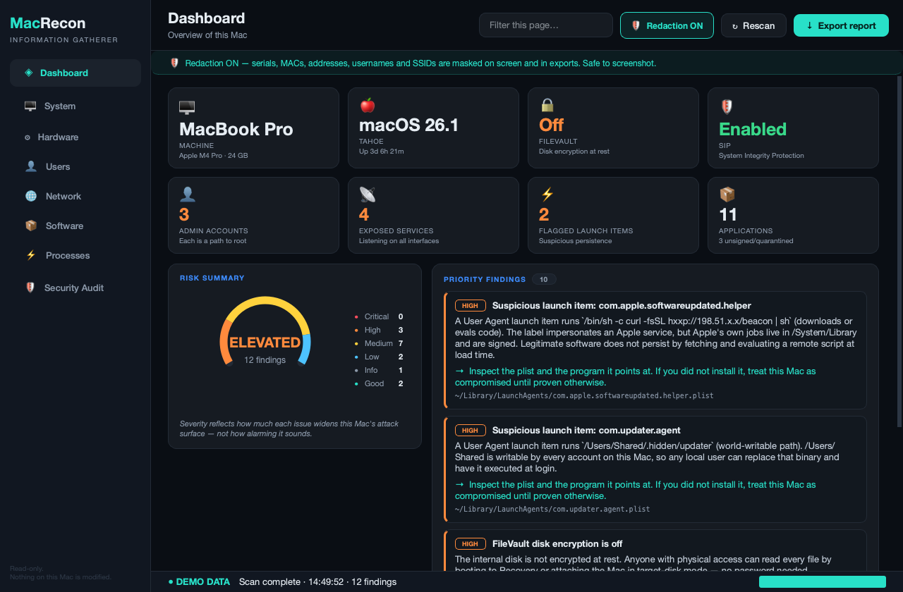
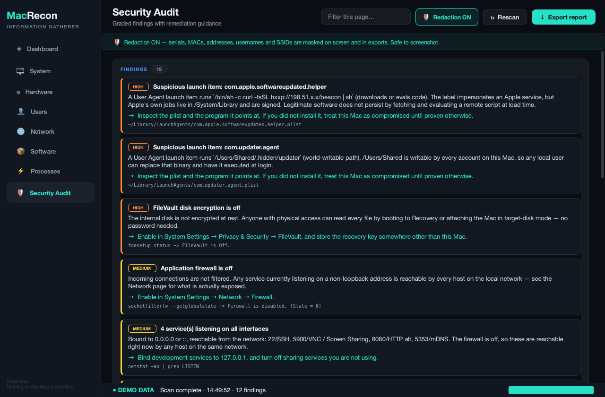
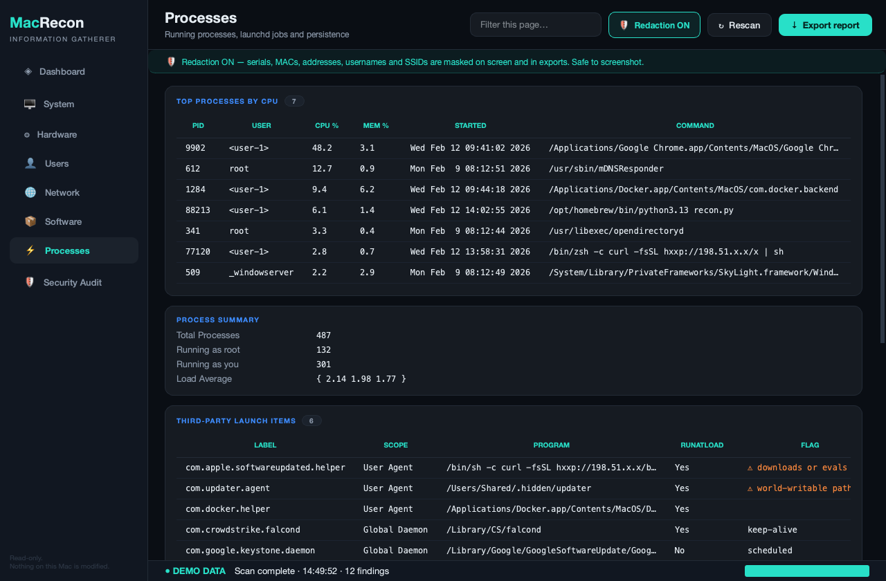
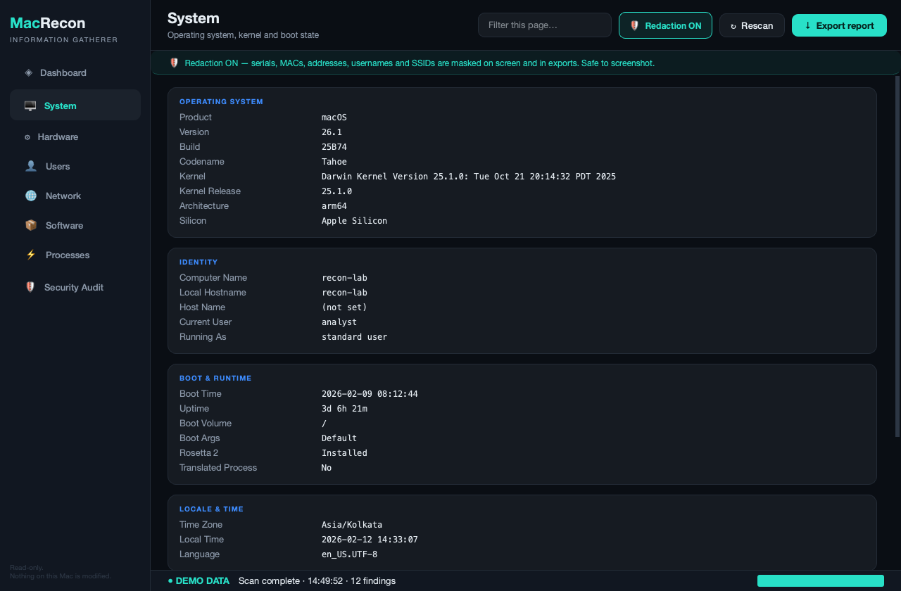
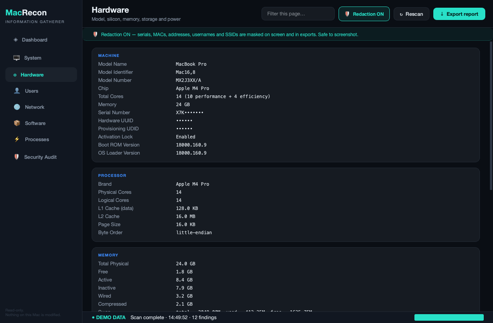
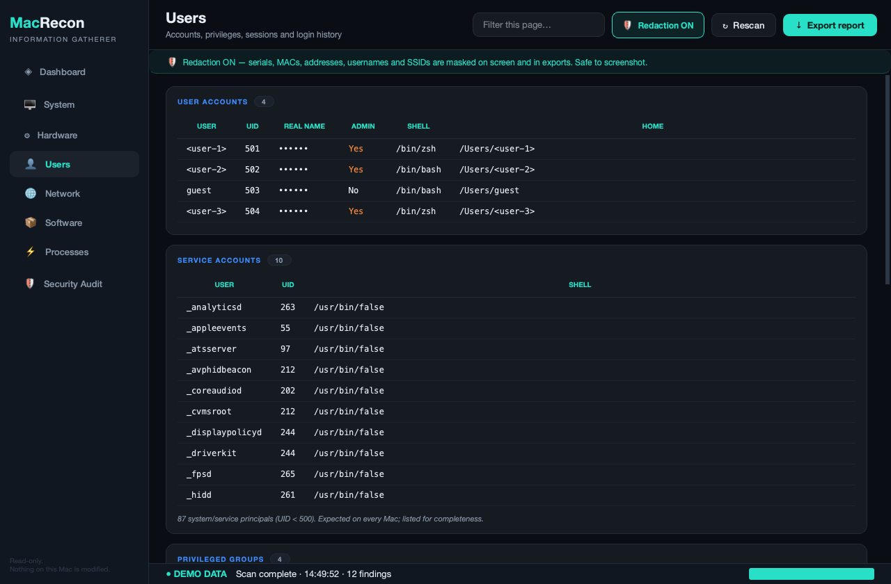
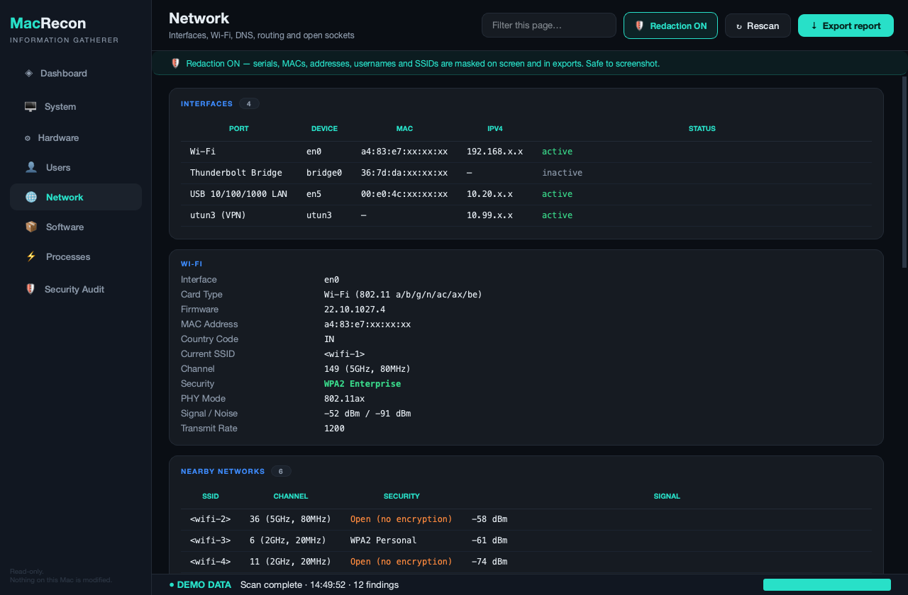
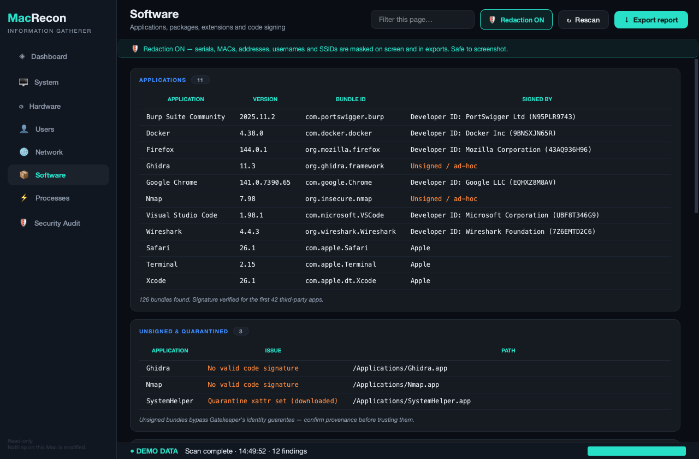

<!-- Banner -->
<p align="center">
  
</p>

<h1 align="center">MacRecon — macOS Information Gatherer</h1>

<p align="center">
  A modern <b>PyQt6 desktop app</b> that collects almost everything worth knowing
  about a Mac — system, hardware, users, network, software, persistence and a
  built-in <b>security audit</b> — and exports it to a clean HTML, JSON or text
  report.
  <br>
  Built for ethical hackers, red teams and blue teams, with
  <b>redaction switched on by default</b> so a report is safe to share.
</p>

<p align="center">
  
  
  
  
  
  
</p>

---

## ✨ Overview

MacRecon gathers reconnaissance-grade intelligence about the Mac in front of you
into one polished dark interface, flags the misconfigurations that actually
matter, and produces a shareable report in one click.

**Everything it does is read-only.** It never changes a setting, installs
anything, or sends a packet to another host. It only reads state that a
defender — or an attacker already on the box — would look at first.

> 🧪 **Runs anywhere.** On macOS it reads the real machine. On Windows or Linux —
> or with `--demo` — it loads a realistic synthetic dataset, so you can explore
> and develop the UI on any OS.

---

## 🛡 Redaction by default — the part that makes it shareable

A recon report is, by construction, a list of everything that identifies a
machine. That's exactly what you want in your own notes and exactly what you
**don't** want in a screenshot, a slide, or a client appendix.

MacRecon masks identifying values everywhere — on screen and in every export —
unless you explicitly turn it off:

| Value | Redacted as | Why that shape |
|---|---|---|
| Serial number | `X7K•••••••` | Confirms a serial exists without giving it up |
| Hardware UUID / UDID | `••••••` | Opaque; pins the exact device |
| MAC address | `a4:83:e7:xx:xx:xx` | Keeps the **OUI** (tells you *Apple*, not *which Mac*) |
| Private IP | `192.168.x.x` | Keeps the **subnet layout**, drops the host |
| Public IP | `<public-ip>` | Nothing useful to keep |
| Username | `<user-1>` | Stable across the report, so you can still correlate |
| Wi-Fi SSID | `<wifi-1>` | Same — "3 different networks" survives |
| Email | `••••••@corp.com` | Domain is context; the local part is the person |

Two properties this is designed around:

- **Redaction removes identity, not evidence.** A launch item flagged
  *"world-writable path"* still shows you `/Users/Shared/.hidden/updater` — a
  column of dots would make the finding worthless. Well-known names (`root`,
  `_windowserver`, `/Users/Shared`) are deliberately **not** masked; they
  identify nobody, and masking them only destroys meaning.
- **The mapping is stable.** The same user is `<user-1>` on every page, so
  "these three processes belong to one account" survives redaction.

Turning it off requires a confirmation, repaints the window amber, and stamps
the export with an unredacted warning.

<p align="center">
  
</p>

---

## 🚀 Quick start

```bash
git clone https://github.com/at0m-b0mb/MacRecon.git
cd MacRecon
pip install -r requirements.txt

python3 macrecon.py                 # GUI, redaction on
```

### Other ways to run it

```bash
python3 macrecon.py --demo          # synthetic data — works on any OS
python3 macrecon.py --no-redact     # show real identifiers (asks first)
python3 macrecon.py --cli           # report straight to the terminal
python3 macrecon.py --cli -o report.html
python3 macrecon.py --cli -o report.json
```

MacRecon runs **unprivileged by default** and says so in its own audit. A few
checks (sudoers contents, firmware password) need root and will report
*Unknown* rather than guess. If you want those, run `sudo python3 macrecon.py
--cli` — but read the source first. Never run a security tool as root on
someone else's say-so, including mine.

---

## 📸 Screenshots

> Every screenshot below is rendered from the **bundled synthetic dataset** — a
> fictional, deliberately badly-configured lab Mac. No real machine appears in
> this repository. `tools/capture.py` enforces that: it forces demo mode *and*
> asserts the host's real serial, UUID, hostname, username and SSID are absent
> from the rendered UI before it will save a single PNG.

| Security Audit | Processes & Persistence |
|---|---|
|  |  |

| System | Hardware |
|---|---|
|  |  |

| Users | Network |
|---|---|
|  |  |

| Software |  |
|---|---|
|  | |

---

## 🔍 What it collects

### 🖥 System
macOS version, build and marketing codename · kernel · architecture and
Apple Silicon vs Intel · computer / local / host names · boot time and uptime ·
custom `boot-args` · Rosetta 2 · translated-process state · timezone and locale ·
a full security-posture snapshot.

### ⚙ Hardware
Model name, identifier and number · chip, performance/efficiency core split ·
memory and live `vm_stat` breakdown · swap · **serial number**, **hardware
UUID**, **provisioning UDID** · Activation Lock · boot ROM · per-volume storage ·
GPUs and attached displays · battery charge, cycle count, condition and health.

### 👤 Users
Every account with UID, real name, shell and home · **who has admin** ·
service principals · privileged group membership (`admin`, `wheel`,
`com.apple.access_ssh`) · active sessions · login history from `wtmp` ·
**SSH private keys, and whether each one has a passphrase** · `authorized_keys`
trust counts.

### 🌐 Network
Every hardware port with MAC, IPv4 and link state · **Wi-Fi**: current SSID,
channel, security mode, PHY, signal/noise · **nearby networks** with open/WEP
called out · DNS resolvers and search domains · default gateway · proxies ·
VPN configurations · ARP neighbours · **listening ports with an exposure
verdict** (loopback vs all-interfaces).

### 📦 Software
Applications with version, bundle ID and **code-signing authority** ·
**unsigned and quarantined** bundles · Homebrew formulae · installer receipts
(which persist after an app is deleted) · **system extensions** ·
**third-party kernel extensions**.

### ⚡ Processes & Persistence
Top processes by CPU · process counts by user · **every launchd domain**
(`~/Library/LaunchAgents`, `/Library/LaunchAgents`, `/Library/LaunchDaemons`),
Apple's own jobs separated out · each job resolved to **the program it actually
executes** · loaded launchd jobs · cron and non-stock periodic scripts.

Launch items are triaged with heuristics that flag what's worth a human look:

| Flag | Meaning |
|---|---|
| ⚠ world-writable path | Runs from `/tmp`, `/Users/Shared`, `/Volumes`… |
| ⚠ downloads or evals code | `curl … \| sh`, `base64 -d`, `osascript -e` |
| ⚠ inline shell | `/bin/sh -c …` |

> Persistence is where macOS intrusions actually live. A plist named
> `com.apple.softwareupdated.helper` means nothing if its `Program` key points
> at `/tmp` — so MacRecon shows you the program, not the label.

### 🛡 Security Audit
Every check is graded, explained in plain English, given a concrete fix, and
**carries the command that produced it** so you can verify the claim instead of
trusting it.

| Check | Severity when failing |
|---|---|
| System Integrity Protection disabled | **Critical** |
| Suspicious launch item | **High** |
| FileVault off | **High** |
| Gatekeeper disabled | **High** |
| Automatic login enabled | **High** |
| Passwordless sudo (`NOPASSWD`) | **High** |
| Unsupported macOS release | **High** |
| Application firewall off | Medium |
| Remote Login / Screen Sharing / ARD enabled | Medium |
| Guest account enabled | Medium |
| Automatic updates disabled | Medium |
| SSH key without a passphrase | Medium |
| Services listening on all interfaces | Medium / Low |
| Excess admin accounts · stealth mode off | Low |

Severity answers *"how much does this widen the attack surface of this Mac"* —
not *"how scary does the word sound"*. SIP is the only Critical, because with
SIP off every other check on the page is advisory: a local attacker can rewrite
the tooling that reports them.

---

## 📤 Reports

One click exports the current scan — honouring the redaction state — as:

- **HTML** — self-contained dark-themed report, severity-coloured, print-friendly
- **JSON** — structured, for pipelines and diffing two scans
- **TXT** — plain text for notes and terminals

---

## 🏗 Architecture

```
macrecon.py                 entry point / CLI
macrecon/
  model.py                  Category · Section · Finding · Severity
  redact.py                 the masking engine (identity out, evidence in)
  demo_data.py              synthetic Mac — what the screenshots come from
  report.py                 HTML / JSON / TXT exporters
  collectors/
    base.py                 read-only command runner, demo mode, plist helpers
    posture.py              shared security probes (SIP, FileVault, firewall…)
    system.py hardware.py users.py network.py software.py processes.py
    security_audit.py       probes -> graded findings
  gui/
    theme.py                palette + semantic colouring rules
    widgets.py              cards, tables, findings, tiles, painted risk gauge
    dashboard.py            overview page
    main_window.py          sidebar, threaded scan, search, export
tools/
  make_banner.py            generates assets/banner.png
  capture.py                screenshots, with a hard no-real-data guard
```

A few decisions worth knowing if you extend it:

- **One model, three renderers.** GUI and all exporters build from the same
  `Category` tree, so redaction has exactly one place to apply and no format
  can bypass it.
- **Collectors don't judge.** A collector reports Gatekeeper is `Disabled`;
  `theme.semantic_color` decides that's alarming. So the same value can read as
  good in one column and bad in another.
- **`run()` refuses to mutate.** The command runner rejects a denylist of
  state-changing binaries, so "read-only" is enforced rather than promised.
- **The scan is threaded.** It takes ~15s on a real Mac (the Wi-Fi scan alone is
  most of it); on the GUI thread that would look like a hang.
- **No `osascript`.** Enumerating login items via System Events is the popular
  recipe, but it trips a TCC consent prompt and blocks the scan behind a modal.
  launchd agents cover the same ground from files we can just read.

---

## 🧪 Notes from building it on current macOS

Things that are wrong in most guides you'll find, and that MacRecon handles:

- **`airport` is gone.** The old
  `/System/Library/PrivateFrameworks/Apple80211.framework/.../airport -I` exits
  127 on current macOS. Wi-Fi state comes from `system_profiler
  SPAirPortDataType` instead.
- **`defaults read com.apple.alf globalstate` no longer resolves.** The key is
  gone; firewall state comes from `socketfilterfw --getglobalstate`.
- **`system_profiler -detailLevel mini` withholds identifiers.** Serial number,
  hardware UUID and the Wi-Fi network info simply aren't in the output —
  `full` is required, which is a deliberate speed bump on collecting them.

---

## 📋 Requirements

- **macOS** for a live scan (developed and verified on macOS 26 Tahoe, Apple
  Silicon). Windows/Linux run demo mode.
- **Python 3.9+**
- **PyQt6** — `pip install -r requirements.txt`

The `--cli` report needs no GUI dependency beyond the standard library.

---

## ⚖️ Legal & ethical use

MacRecon is for **authorised** security work: your own machines, your
organisation's fleet, a lab, or an engagement you have written permission for.

It is read-only and gathers only local state — but a completed unredacted report
is sensitive: it identifies a specific machine and its user. Treat an
unredacted export the way you'd treat any other engagement artefact: store it
encrypted, share it only with the asset owner, and delete it when the
engagement ends.

Running it against a machine you do not own or have permission to assess may be
illegal. That's on you.

---

## 📄 License

MIT — see [LICENSE](LICENSE).

---

<p align="center">
  Built by <a href="https://github.com/at0m-b0mb"><b>at0m-b0mb</b></a><br>
  <sub>If MacRecon saved you time on an assessment, a ⭐ is appreciated.</sub>
</p>
